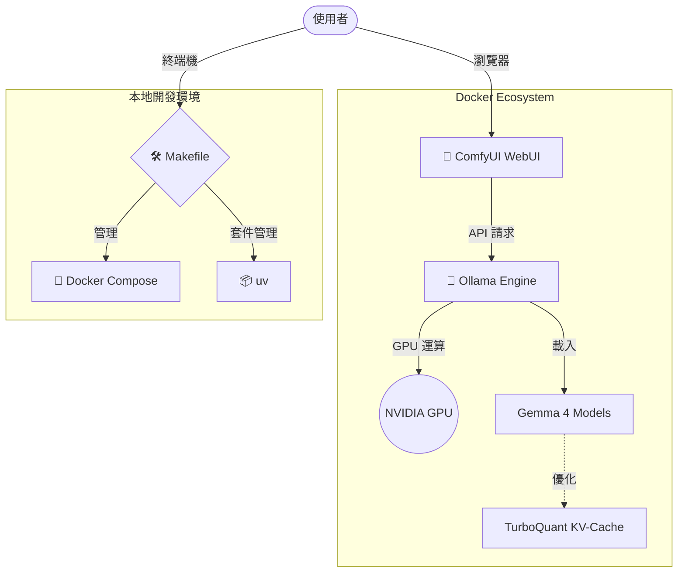

# ✨ Gemma 4 + ComfyUI：全方位 AI 創作工作站

[](https://blog.google/)
[](https://research.google/)
[](https://www.docker.com/)
[](https://github.com/astral-sh/uv)

本專案是一個深度整合的本地 AI 工作環境，結合了 Google **Gemma 4** 多模態模型、**ComfyUI** 節點式開發界面，以及最新的 **TurboQuant** KV-cache 優化技術。

---

## 🐣 新手開發手冊 (Beginner's Guide)

如果你是第一次接觸本地 AI 開發，別擔心！這個專案已經將複雜的環境配置簡化。

### 1. 核心觀念
*   **Ollama**: 負責執行文字與多模態模型（如 Gemma 4）的後端。
*   **ComfyUI**: 負責圖像生成與流程控制的畫布界面。
*   **Docker**: 像是一個「數位貨櫃」，將所有的程式碼與環境打包，確保你在任何電腦上啟動的結果都一致。
*   **uv**: 當今最快的 Python 套件管理工具，負責處理專案的依賴關係。

### 2. 硬體優化：TurboQuant
針對本地端顯卡，特別配置了 **TurboQuant** 技術。它能壓縮對話過程中的暫存記憶體 (KV-cache)，讓你能進行更長的對話而不導致顯存溢出。

---

## 💻 WSL 環境準備 (WSL Environment Setup)

本專案強烈建議在 **Windows 11 + WSL2 (Ubuntu 22.04+)** 環境下執行，以獲得最佳的 GPU 效能。

### 1. 安裝 WSL 2
若尚未安裝，請開啟 PowerShell 並執行：
```powershell
wsl --install
```

### 2. 配置 Docker Desktop
1.  安裝 [Docker Desktop for Windows](https://www.docker.com/products/docker-desktop/)。
2.  進入 **Settings > General**，勾選 **Use the WSL 2 based engine**。
3.  進入 **Settings > Resources > WSL Integration**，開啟您的 Ubuntu 分發版開關。

### 3. NVIDIA GPU 支援 (重要)
確保您的 Windows 已安裝最新的 NVIDIA 驅動程式。WSL 會自動橋接 GPU 資源。您可以透過以下指令確認：
```bash
nvidia-smi
```

### 4. 安裝 uv
在 WSL 終端機中執行以下指令安裝極速套件管理器：
```bash
curl -LsSf https://astral.sh/uv/install.sh | sh
source $HOME/.cargo/env
```

---

## 🚀 執行步驟 (Execution Steps)

本專案已配置 **Makefile**，讓操作變得極其簡單。

### 第一步：環境初始化
在 WSL 終端機執行：
```bash
cp .env.example .env
make sync
```

### 第二步：一鍵優化啟動
執行以下指令，系統將自動套用 **TurboQuant** 與 **Flash Attention** 並建置服務：
```bash
make start
```

### 第三步：監控下載進度
由於模型映像檔較大，您可以監控實時進度：
```bash
make logs
```

### 第四步：啟動模型對話
待 Ollama 啟動完成後，開啟另一個視窗執行：
```bash
make gemma4
```

---

## 💎 進階優化：Gemma 4 + TurboQuant
本專案預設套用了以下優化參數：
- **KV Cache 壓縮**：`turbo4` (4-bit 壓縮)，大幅降低長對話時的顯存消耗。
- **運算加速**：`Flash Attention` (原生支援傳遞至 Ollama)，提昇推論速度。
- **記憶體分配**：特別針對 **RTX 2060 (6GB)** 進行平衡，確保 ComfyUI 生圖與 Gemma 4 對話可併行。

---

## 🛠️ Makefile 指令集參考
| 指令 | 說明 |
| :--- | :--- |
| `make start` | 建置並在背景啟動所有服務 |
| `make stop` | 停止並移除容器 |
| `make logs` | 查看實時控制台日誌 |
| `make gemma4` | 進入 Gemma 4 交互對話模式 |
| `make shell` | 進入 ComfyUI 容器內部 |
| `make sync` | 同步本地 Python 環境 (uv) |

---

## 🏗️ 系統架構 (Architecture)



---

## 💡 常見問題與排除 (Troubleshooting & FAQ)

### Q: 啟動時顯示 `nvidia-container-cli: initialization error`？
**A**: 這通常是因為您的 Docker Desktop 尚未正確連結 WSL 2。請確認您已安裝最新的 NVIDIA Windows 驅動程式，並在 Docker 設定中開啟了 WSL Integration。

### Q: 顯存 (VRAM) 還是不足怎麼辦？
**A**: 
1. 確保您只執行 **`gemma4:e2b`** 版本。
2. 嘗試使用 `turbo2` 壓縮（修改 `docker-compose.yml` 中的環境變數）。
3. 關閉瀏覽器中不必要的頁籤，因為瀏覽器也會消耗不少顯存。

### Q: 如何更新 Gemma 4 模型？
**A**: 進入 Ollama 容器執行重新拉取：
```bash
docker exec -it ollama ollama pull gemma4:e2b
```

### Q: `make start` 指令無效？
**A**: 請確保您已安裝 `build-essential`（包含 make 工具）。在 Ubuntu/WSL 中執行 `sudo apt update && sudo apt install build-essential`。

---

## 🤝 社群資源
- **Ollama**: [GitHub](https://github.com/ollama/ollama)
- **ComfyUI**: [GitHub](https://github.com/comfyanonymous/ComfyUI)
- **Astral uv**: [Documentation](https://docs.astral.sh/uv/)

---

## 📜 系統需求與聲明
*   **最低配置**: NVIDIA GPU (顯存 6GB+) / 16GB RAM。
*   **許可**: 本專案編排腳本採 Apache 2.0。Gemma 4 模型需遵守 Google 官方使用規範。

---

*✨ 現在，開啟瀏覽器，開始你的 AI 創作之旅吧！ ✨*
